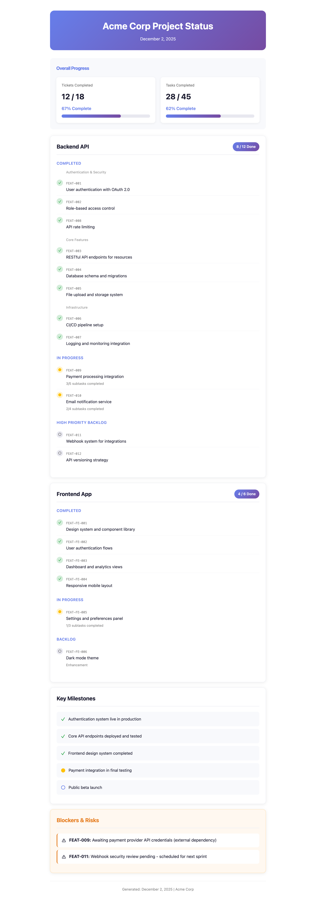

<p align="center">
  
</p>

<h1 align="center">tpm-mcp</h1>

<p align="center">
  <strong>Your AI-powered Technical Project Manager in a box</strong>
</p>

<p align="center">
  <a href="#installation"></a>
  <a href="LICENSE"></a>
  <a href="#"></a>
  <a href="#"></a>
</p>

<p align="center">
  <em>Have standups with Claude. Track features. Break down tasks. Ship faster.</em>
</p>

---

## What is this?

**tpm-mcp** is a local MCP (Model Context Protocol) server that gives Claude the ability to track your projects, features, and tasks. Think of it as having a dedicated TPM who:

- Remembers what you're working on across sessions
- Breaks down complex features into manageable tasks
- Tracks progress and blockers
- Gives you instant status updates

All data stays local in a fast SQLite database. No cloud. No subscriptions. Just you and your AI TPM.

## Demo

```
You: :TPM: what's in progress?

Claude: Here's your current roadmap:

# Roadmap Summary
**Stats**: 3/8 tickets, 12/25 tasks (48% complete)

## ExampleOrg
### backend-api
Tickets: 3/5 done

- [~] **FEAT-003**: Payment Integration (high)
  Tasks: 2/4
    - [~] TASK-003-1: Stripe webhook handler
    - [ ] TASK-003-2: Invoice generation

- [ ] **FEAT-004**: Email Notifications
  Tasks: 0/3
```

## Features

| | |
|---|---|
| **Fast** | Sub-millisecond queries with SQLite + WAL mode |
| **Local** | All data in `~/.local/share/tpm-mcp/tpm.db` |
| **Natural** | Just talk - "I finished the auth feature" |
| **Hierarchical** | Orgs → Projects → Tickets → Tasks |
| **Rich Metadata** | Priority, tags, assignees, complexity, notes |
| **Export/Import** | Full JSON export/import for backup and migration |

## Installation

### 1. Clone & Install

```bash
git clone https://github.com/yourusername/tpm-mcp.git
cd tpm-mcp
uv venv && uv pip install -e .
```

### 2. Add to Claude Code

```bash
claude mcp add tpm --scope user -- uv run --directory /path/to/tpm-mcp tpm-mcp
```

<details>
<summary>Or manually edit settings.json</summary>

Add to `~/.claude/settings.json`:

```json
{
  "mcpServers": {
    "tpm": {
      "command": "uv",
      "args": ["run", "--directory", "/path/to/tpm-mcp", "tpm-mcp"]
    }
  }
}
```

</details>

### 3. (Optional) Enable TPM Agent Behavior

For the full experience, add the TPM agent instructions:

```bash
# Symlink to your project's .claude folder
mkdir -p .claude
ln -s /path/to/tpm-mcp/agents/tpm.md .claude/tpm.md
```

Then in your `CLAUDE.md`:
```markdown
See .claude/tpm.md for project tracking workflow.
```

## Usage

### Quick Commands

| Say this... | Claude will... |
|------------|----------------|
| `:TPM: status` | Show full roadmap |
| `:TPM: add auth feature` | Create a new ticket |
| `I finished the payment integration` | Mark ticket done |
| `Break down the API refactor` | Create subtasks |
| `What's blocking us?` | Show blocked items |

### Workflow Example

```
You: :TPM: Add user authentication to the backend project

Claude: Created ticket FEAT-005: "User Authentication" in backend-api
        Status: backlog, Priority: medium

You: Make it high priority and break it down

Claude: Updated FEAT-005 to high priority. Created tasks:
        - TASK-005-1: Design auth schema
        - TASK-005-2: Implement JWT middleware
        - TASK-005-3: Add login/logout endpoints
        - TASK-005-4: Write auth tests

You: Starting on the JWT middleware

Claude: Marked TASK-005-2 as in-progress.
        FEAT-005 is now in-progress.

You: Done with middleware, tests pass

Claude: Marked TASK-005-2 as done (1/4 tasks complete)
```

## Tools Reference

<details>
<summary><strong>View Tools</strong></summary>

| Tool | Description |
|------|-------------|
| `roadmap_view` | Full roadmap with all orgs, projects, tickets, tasks |
| `ticket_get` | Detailed view of one ticket with its tasks |
| `info` | Server stats and database info |

</details>

<details>
<summary><strong>Ticket Tools</strong></summary>

| Tool | Description |
|------|-------------|
| `ticket_create` | Create ticket with title, description, priority, tags |
| `ticket_update` | Update status, priority, assignees, etc. |
| `ticket_list` | List tickets, filter by project or status |

</details>

<details>
<summary><strong>Task Tools</strong></summary>

| Tool | Description |
|------|-------------|
| `task_create` | Create task under a ticket |
| `task_update` | Update task status, details, complexity |
| `task_list` | List tasks, filter by ticket or status |

</details>

<details>
<summary><strong>Organization Tools</strong></summary>

| Tool | Description |
|------|-------------|
| `org_create` | Create organization |
| `org_list` | List all organizations |
| `project_create` | Create project under org |
| `project_list` | List projects |
| `note_add` | Add note to any entity |

</details>

## Data Model

```
Organization
└── Project
    └── Ticket (feature/epic/bug)
        ├── Tasks
        └── Notes
```

**Ticket Statuses**: `backlog` → `planned` → `in-progress` → `done` | `blocked`

**Task Statuses**: `pending` → `in-progress` → `done` | `blocked`

**Priorities**: `critical` > `high` > `medium` > `low`

## Export & Import

Export and import your project data to JSON for backup, restore, or interoperability with other tools.

### Export Data

Export all your project data to JSON:

```bash
# Export to stdout
uv run tpm-json-export

# Export to file
uv run tpm-json-export -o backup.json

# Export from custom database
uv run tpm-json-export --db-path /path/to/custom.db -o backup.json
```

### Import Data

Import data from a JSON export file to recreate your database or restore from backup:

```bash
# Validate JSON file without importing
uv run tpm-json-import --dry-run backup.json

# Import into default database
uv run tpm-json-import backup.json

# Import into custom database
uv run tpm-json-import --db-path /path/to/db.db backup.json

# Clear existing data and import
uv run tpm-json-import --clear backup.json
```

The JSON format includes all data: organizations, projects, tickets, tasks, notes, and task dependencies. Use cases:

- **Backup & Restore**: Export your data regularly, restore if database gets corrupted
- **Recreate Database**: Start fresh by importing from a previous export
- **Export to Other Tools**: Use the JSON format to migrate to other project management tools
- **Sync Between Machines**: Export on one machine, import on another

## PDF Status Reports

Generate beautiful, shareable PDF reports from your project data.

<p align="center">
  
</p>

<details>
<summary><strong>Setup & Usage</strong></summary>

### Using the Report Skill

The `tpm-report` skill teaches Claude how to generate professional status reports. To enable it:

```bash
# Copy the skill to your project
cp -r /path/to/tpm-mcp/skills/tpm-report .claude/skills/
```

Then ask Claude:
```
You: Generate a project status report

Claude: [Fetches roadmap data, generates styled HTML, converts to PDF]
        PDF report saved to: Project-Status-2025-12-02.pdf
```

### Prerequisites

- **tpm-mcp**: This MCP server (for `roadmap_view` data)
- **Playwright MCP**: For automatic HTML → PDF conversion

#### Installing Playwright MCP

```bash
# Add Playwright MCP (headless mode recommended for PDF generation)
claude mcp add playwright-headless --scope user -- npx @playwright/mcp@latest --headless

# Or with isolated mode (separate browser profile)
claude mcp add playwright-headless --scope user -- npx @playwright/mcp@latest --isolated --headless
```

<details>
<summary>Or manually edit settings.json</summary>

Add to `~/.claude/settings.json`:

```json
{
  "mcpServers": {
    "playwright-headless": {
      "command": "npx",
      "args": ["@playwright/mcp@latest", "--headless"]
    }
  }
}
```

</details>

Without Playwright, Claude will generate an HTML file you can manually print to PDF.

### What's in the Report?

| Section | Contents |
|---------|----------|
| **Progress Overview** | Visual progress bars for tickets and tasks |
| **Project Breakdown** | Completed, in-progress, and backlog items per project |
| **Key Milestones** | Major achievements and current focus |
| **Blockers & Risks** | Items requiring attention |

### Manual Report Generation

If you prefer manual control, use `roadmap_view` with JSON format:

```
You: :TPM: show me the roadmap as JSON

Claude: [Returns structured JSON data]
```

Then use your preferred tool to format the output.

</details>

## Migration from Legacy Trackers

Coming from a legacy JSON-based tracker with a different format?

```bash
uv run tpm-migrate /path/to/old-tracker
```

This tool converts from older JSON tracker formats. For standard export/import, use `tpm-json-export` and `tpm-json-import` above.

## Development

```bash
# Install with dev dependencies
uv pip install -e ".[dev]"

# Run tests
uv run pytest tests/ -v
```

## Why Local?

- **Privacy**: Your project data never leaves your machine
- **Speed**: SQLite is incredibly fast for this use case
- **Reliability**: No API rate limits, no outages, works offline
- **Simplicity**: One database file, easy to backup or sync

## License

MIT - do whatever you want with it.

## Citation
---
```
@software{Bhatia_TPM-MCP_A_Local_2025,
  author = {Bhatia, Urjit Singh},
  license = {MIT},
  title = {{TPM-MCP: A Local Technical Product Manager MCP Server}},
  url = {https://github.com/urjitbhatia/tpm-mcp},
  year = {2025}
}
```
---

<p align="center">
  <sub>Built with vibes ✨</sub>
</p>
